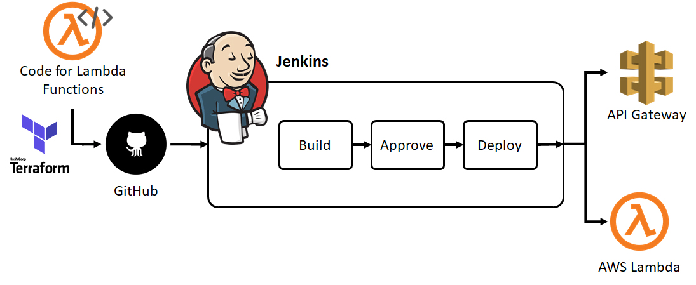
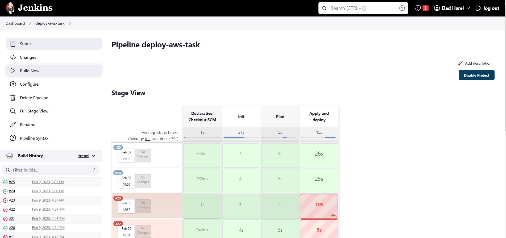
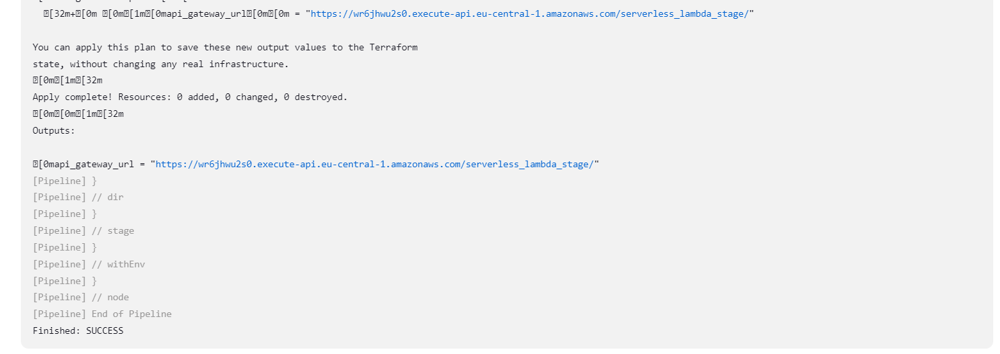
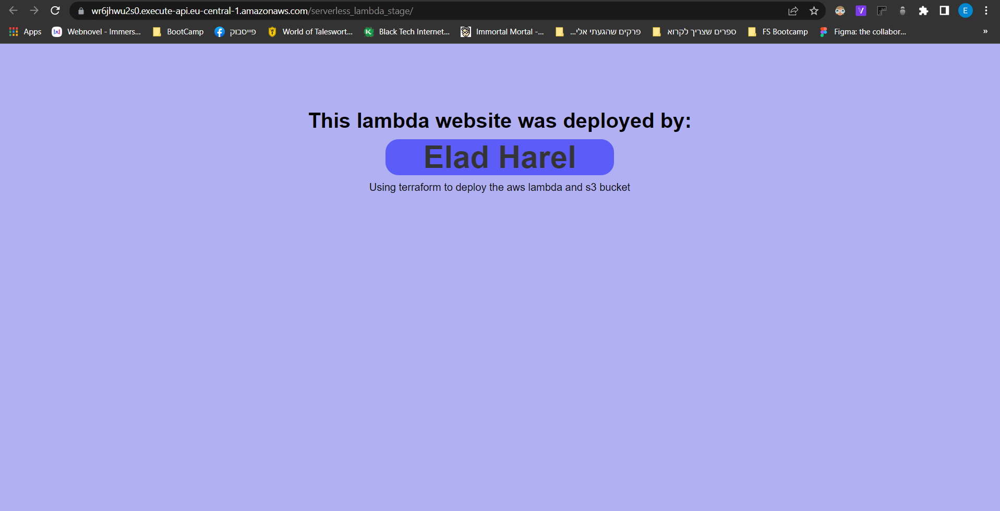

# Terraform Deploy S3+Lambda on AWS with Jenkins 





### In this project I used Terraform to deploy API gateway+lambda+S3 bucket in AWS while using a Jenkins process based on Jenkins declarative pipeline  
<hr>

## Prerequisites
* Account in AWS
* Jenkins with terraform version 1.3.7+ installed on it and access to github account with the project files
* Terraform 'tfvars' file that contains all the variables needed for the setup(access key and secret key)
* Big cup of coffee 😉☕

## Jenkins:
1. Log in to your Jenkins server
2. Connect your Jenkins to your Github account using a private key(Github should have the public key) - This step can be skipped if the repo is public - [How to connect Github to Jenkins video](https://www.google.com/search?q=add+github+repository+to+jenkins&rlz=1C1TIGY_enIL721IL721&sxsrf=AJOqlzUv2b5Ha8EGuOo412ZIrwy0G9fe_Q:1675952999207&source=lnms&tbm=vid&sa=X&ved=2ahUKEwiy9LW504j9AhXJcKQEHXSAB5wQ_AUoAXoECAIQAw&biw=1536&bih=722&dpr=1.25#fpstate=ive&vld=cid:2b5124f4,vid:jSm0YZ-NQAc)
3. Create a new Jenkins Pipeline linked to your GitHub repository

## Terraform configuration:
1. Make sure to make a 'tfvars' file inside the setup directory in you project at your Jenkins server


    - tfvars file example:
    ```sh
    sorceDirectory     = "../my_directory"
    bucketName         = "demo-app-bucket"
    accessKey          = "thisIsImportantToHave"
    secretKey          = "thisIsAlsoImportantToHave"
    zipFile            = "zip"
    region             = "eu-central-1"
    appOutputPath      = "../my_directory"
    codeObjectkey      = "app.zip"
    deployRoleName     = "costume_role"
    lambdaFileName     = "main"
    lambdaFileFunction = "lambda_handler"
    awsLambdaRuntime   = "python3.8"
    lambdaName         = "your_app_function"
    ```
2. Make sure your Jenkins pipeline user have permission to access the created 'tfstate' and 'tfstate.backup' file, as the pipeline may run the first time but after trying to read state in second time it will fail because of permission issues.
3. Optional - Saving state on an s3 bucket. it is best practice to save the state on the cloud so you never lose the state even if terraform apply/destroy was executed from outside your Jenkins server. this will involve you creating S3 bucket before hand and updating the terraform file to store the state on it.

# Running the pipeline:
1. After making sure everything is set up to start you need to create a new Jenkins pipeline. this pipeline should be connected to the project git repo
2. Running the the pipeline, in this project we did not set a triggered pipelined (pipeline that will run at every commit to a specific branch) so you will manually run the pipeline.  
Jenkins will take you repo, clone it and then execute the stages we defined in the Jenkins file - Init, Plan, Apply
### It should look like this:


<br>
3. If it fails you can view the logs and output to figure out what went wrong, and if it passed successfully you can find the link to lambda in the output.

### it should look like this:

<br>    

### Feel free to edit the app main.py file to make your own lambda website, after going to the getaway link my app will look like this:


<br>    

# Summary
By going through all the steps and making sure you have the prerequisites you:
- deployed a lambda that serves a webpage using AWS lambda and API getaway.
- constructed the infrastructure for it using terraform and executed the deployment with a Jenkins process based on Jenkins declarative pipeline.

### Feel free to contact me for questions or opinions about the project. 🤙

